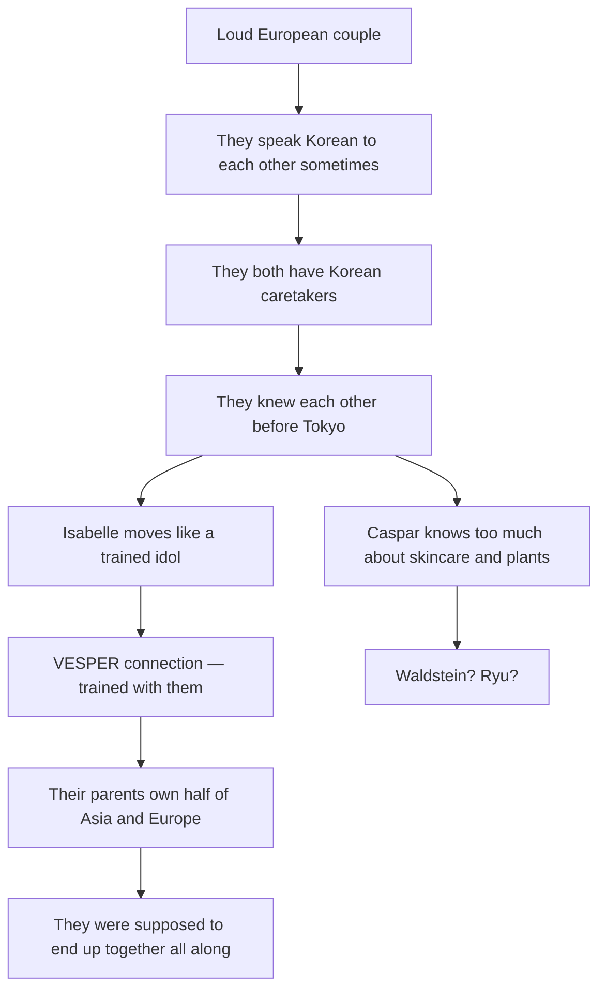

# The Lore Bible — Isabelle & Caspar

## Revised Edition

---

### The Families

#### van Rijn–Shin Clan

- **European root:** van Rijn Private Banking & Global Real Estate — Dutch
  banking dynasty, 17th-century old money based in Wassenaar. The kind of wealth
  that doesn't appear on lists because the lists are compiled by people who work
  for them.
- **Korean root:** Shin Entertainment — Asia's premier K-pop agency, built
  post-IMF crisis in the late 1990s by a former dancer who understood that
  cultural influence was the only commodity that appreciated faster than real
  estate.
- **Father:** Willem van Rijn — CEO of van Rijn Private Banking & Global Real
  Estate, perpetually in Zurich, London, or Singapore. Calls Isabelle _schatje_
  on the phone at 5:30 AM Geneva time. Believes privilege is a loan, not a gift.
  "Money is a tool. A tool is only useful when you're holding it. The moment you
  show it, it becomes a weapon."
- **Mother:** Shin Hee-yeon (신희연) — CEO of Shin Entertainment, perpetually in
  Seoul or Los Angeles. Five-four, compact, sharp bob, minimal makeup. Enters
  rooms the way a conductor enters an orchestra pit. Loves her daughter the way
  she loves her artists: fiercely, strategically, and from behind a desk. Her
  gift baskets arrive with printed cards signed by her assistant. Her actual
  love arrives in the form of structural decisions that take years to reveal
  their purpose.
- **Power base:** Finance merged with cultural soft power — the money moves
  invisibly while the entertainment arm shapes public-facing Asian pop culture.
- **Marriage logic:** Old European capital married to new Korean cultural
  dominance — a merger disguised as a love story.

#### Waldstein–Ryu Clan

- **European root:** Waldstein Botanicals & Aesthetics — the number one
  ultra-luxury skincare brand in Asia, rooted in Austrian/Bohemian minor
  nobility that pivoted to luxury branding. Helena Waldstein does not believe in
  visible logos. She believes in _materials._ In the quiet confession of a
  hand-stitched seam, the weight of a door handle milled from solid brass, the
  particular matte grain of Bavarian oak that says nothing to most people and
  everything to the ones who matter.
- **Korean root:** Ryu BioPharma & Chemical — industrial chaebol,
  chemicals-to-pharma pipeline. The engine behind the beauty.
- **Mother:** Helena Waldstein — CEO of Waldstein Botanicals & Aesthetics,
  perpetually in Paris, Tokyo, or Shanghai. Silver-blonde hair, navy blazer, a
  single gold chain at her throat with the Waldstein logo rendered in miniature.
  Communicates through objects — ships apricot jam from the Wachau Valley,
  commissions a toaster from a workshop in Darmstadt (eleven rejected
  prototypes; the seventh had a logo, the ninth had a visible seam, the third
  was "too shiny — it looked aspirational instead of inevitable"). A good
  product should feel _inevitable_ — like it couldn't have been any other way.
- **Father:** Ryu Ji-seok (류지석) — Chairman of Ryu BioPharma & Chemical,
  perpetually in Seoul or Frankfurt. Communicates in sentence fragments and
  strategic silences. Replies to family group chats with a single emoji: 👍.
  This is, for Ryu Ji-seok, an extravagant display of emotion.
- **Power base:** Beauty and biotech vertical integration — Waldstein is the
  consumer-facing brand, Ryu is the industrial engine behind it.
- **Marriage logic:** European luxury prestige married to Korean industrial
  infrastructure — another merger disguised as a love story.

#### The Inter-Family Web

The van Rijn–Shin and Waldstein–Ryu clans orbit each other through overlapping
corporate boards, charity galas, and real estate circles spanning Alpine resorts
and Jeju coastlines. Close enough to plan a generational merger-marriage between
their children. Distant enough that the children never grow up as siblings.

The partnership between Waldstein Botanicals and Shin Entertainment is
eventually formalized: brand ambassador deals, limited-edition product
collaborations, tour sponsorship. **VESPER — "Somebody Knows" ASIA TOUR —
Presented by Shin Entertainment. In partnership with Waldstein Botanicals.** The
corporate architecture and the personal architecture converge — but whether they
converge because of the children or despite them is the question both families
are eventually forced to answer.

---

### The Children

#### Isabelle van Rijn / Shin Ji-won (신지원)

- **Born:** ~2001
- **Home base:** Wassenaar, Netherlands — old-money enclave near The Hague.
  Eighteen-foot ceilings. Gardens maintained for generations. The North Sea
  visible on clear days.
- **Appearance:** 5'10", statuesque. Heavy wavy caramel-blonde hair — the color
  of raw honey held up to a window. Pale glowing "glass skin" (the Waldstein
  Botanicals clinical regimen, eight steps, non-negotiable). Large hazel-green
  upturned eyes. Single shallow dimple on the left side, visible only during the
  full smile. Has the flawless posture and physical grace of a trained dancer —
  the spine a single unbroken line from skull to tailbone.
- **Languages:** Dutch (native), Korean (native — kitchen-table fluency from
  Jungsook, refined to professional level during Seoul exile), English (fluent —
  international school polish), French (functional), German (conversational —
  taught by Caspar), Japanese (near-native — disguised as intermediate through
  the "language filter")
- **The language filter:** Deliberately calibrated performance of slight
  hesitation and occasional pauses in Japanese. Just enough to make people speak
  slowly and clearly to her. Just enough to make them assume she's catching up
  when she's actually three sentences ahead. The filter works in all directions
  — it can make fluency sound like effort, and it can make the most important
  person in her life sound like a name she's heard once and forgotten.
- **Physical training:** Ballet — five years, Amsterdam, technically competent,
  the foundation beneath everything else. The extensions, the port de bras, the
  continuous line. This is the grammar underneath the K-pop choreography she
  later learns. The grammar that Park Jisoo absorbs and translates and weaves
  into VESPER's movement vocabulary so thoroughly it becomes inseparable from
  who they are.
- **Emotional anchor:** Moon Jungsook (문정숙), her Korean caretaker since
  birth.
- **Parent dynamic:** Both parents working constantly. Isabelle is raised by
  staff and structure, not by warmth from above. Willem's love arrives as Dutch
  pet names and wired allowances. Hee-yeon's love arrives as gift baskets and
  structural decisions. The gap between these two forms of love and the warmth
  Isabelle actually needs is filled by Jungsook — and eventually, by four women
  in a Seoul practice room.

#### Caspar Waldstein / Ryu Tae-sung (류태성)

- **Born:** ~2001
- **Home base:** Munich, Germany — Bogenhausen. White-plastered villa behind a
  low wall, the garden green and orderly. The bakery two streets away where his
  father bought pretzels every Saturday morning.
- **Appearance:** 6'1", lean and broad-shouldered. Aristocratic features,
  flawless pale skin, thick straight dark ash-blonde hair that falls across his
  forehead. Icy pale blue almond-shaped eyes — the color of glacial meltwater.
  The face of a European fashion campaign that happens to be set in a Japanese
  school. After the exile: the shoulders broadened by agricultural labor, the
  hands roughened, the body functional rather than decorative. A farm-built body
  that reads as mysterious to teenagers used to noise.
- **Languages:** German (native), Korean (native — carried by Myunghi, deepened
  during Jeju exile into regional fluency), English (fluent), Japanese
  (near-native — same language filter as Isabelle)
- **Emotional anchor:** Bae Myunghi (배명희), his Korean caretaker since birth.
- **Parent dynamic:** Both parents working constantly. Helena communicates
  through objects and design — the toaster, the jam, the shampoo. Ji-seok
  communicates through emoji and presence. Caspar is raised by Myunghi's cooking
  and corrections and the particular love that expresses itself through exact
  measurements and absolutely no sentimentality.

---

### The Caretakers

#### Moon Jungsook (문정숙)

- **Assigned to:** Isabelle, since birth
- **Path:** Wassenaar → Le Rosey → separated during exile → reunited in Tokyo
- **The person:** Compact, center-parted bob that has never moved a millimeter.
  Navy linen apron over a white cotton blouse. Posture suggesting she has been
  standing at attention since roughly 1987. Distributes praise the way a central
  bank distributes currency — sparingly, deliberately, with an awareness that
  the value is proportional to the rarity. Cooks Korean food that is _correct_,
  which is a higher standard than merely good. Calls Isabelle's bento
  preparation a matter of household honor. Starches school blouses twice because
  the fabric is "not what I'm used to." Verified cold-chain documentation for
  strawberries at the Kinokuniya in Aoyama by making the produce manager show
  her the storage temperature logs.
- **Loyalty:** Reports to the families but leaves things out — loyal to Isabelle
  first.

#### Bae Myunghi (배명희)

- **Assigned to:** Caspar, since birth
- **Path:** Munich → Le Rosey → separated during exile → reunited in Tokyo
- **The person:** Tall, broad-shouldered, perm maintained with spiritual
  devotion. Wears an apron printed with small cartoon cats — a gift from Caspar
  received with a single raised eyebrow and worn every day since. Her cooking is
  better than Jungsook's. Caspar would never say this aloud. Jungsook knows it
  anyway, and it is a source of quiet, permanent war. Irons creases into school
  trousers because "a man without a crease is a man without self-respect." Makes
  homemade gochujang in the fall and ships it from Seoul. Jungsook would commit
  a crime for the recipe. Myunghi would rather die.
- **Loyalty:** Reports to the families but leaves things out — loyal to Caspar
  first.

#### Their Relationship

Jungsook and Myunghi know each other. Both are ajumma-generation women — warm
but firm, formal Korean manners. They were powerless against the families during
the exile but never stopped caring. In Tokyo they conduct nightly phone calls —
a parallel diplomatic channel, exchanging intelligence across the two households
with the systematic thoroughness of a joint surveillance operation. They
coordinate shopping, schedules, apartment maintenance, and the emotional weather
of two teenagers with the focused intensity of parents running an operation.

"Park-ssi. It's Saturday. Daikanyama. Two o'clock. Make sure he wears a proper
jacket."

They cook too much and send the kids home with containers for the other
household. They are the only continuity these children have ever had.

---

### Master Timeline

- **0 / ~2001:** Born. Jungsook assigned to Isabelle in Wassenaar. Myunghi
  assigned to Caspar in Munich.
- **0–10 / 2001–2011:** Childhood. Dutch private schools for Isabelle, German
  private schools for Caspar. Korean cultural and language tutoring runs
  parallel to European education. Ballet training begins early for Isabelle.
  Neither child knows the other exists.
- **10 / 2011:** Both enter Institut Le Rosey, Switzerland. Isabelle pulled from
  Wassenaar, Caspar straight after Grundschule.
- **10–13 / 2011–2014:** Friendship develops naturally at Le Rosey. Same dorm
  circles, both half-Korean, both raised by Korean caretakers. The parents
  simply put them in proximity and let them figure out the rest.
- **13 / Spring 2014:** The breakpoint. Discovery of the arrangement, the
  poisoning of trust, the kiss, the rejection, the rebellion.
- **13–16 / Mid 2014–Early 2017:** The exile. 2.5 years. Privilege stripped.
  Caretakers gone — Jungsook and Myunghi taken away, the one constant in their
  lives gone. No contact between Isabelle and Caspar. No information about each
  other. Isabelle in Seoul training with VESPER. Caspar on Jeju as a botanical
  farm laborer.
- **16 / April 2017:** Reunion. First day of Japanese high school. Entrance
  ceremony at Tokyo Metropolitan Setagaya Sogo High School. Neither knows the
  other will be there.

---

### Le Rosey Period (2011–2014)

#### How They Met

No grand introduction. Two ten-year-olds in the same elite Swiss boarding
school, both half-Korean, both with Korean caretakers hovering at the margins of
campus life. The parents engineered the proximity — same school, same year,
overlapping social circles — and then stepped back. Isabelle and Caspar did the
rest naturally.

#### How the Friendship Built

Three years of shared meals, study sessions, weekend outings, ski trips, and the
quiet understanding that comes from being the same kind of hybrid in a sea of
European old money. They recognized each other — not just ethnically but
experientially. Both raised by caretakers instead of parents. Both fluent in
languages their classmates didn't speak. Both navigating the gap between their
European faces and their Korean interiors.

By twelve they were inseparable. By thirteen they were something more — not yet
romantic, but operating in the charged, undefined territory where friendship
develops its own gravity. Isabelle taught him Dutch words during study hall. He
taught her German. They ate Myunghi's Korean food together in the dormitory
common room while their Swiss classmates ate fondue. They were a country of two.

---

### The Breakpoint (Spring 2014)

#### The Sequence

**Stage 1 — Discovery of the arrangement.** At thirteen, Isabelle and Caspar
learn that their meeting at Le Rosey was not coincidence. Their families have
planned a merger-marriage. Every shared moment, every natural step of their
friendship, is reframed as engineered. The trust between them is poisoned
instantly.

**Stage 2 — The poisoning.** Neither can look at the other without wondering
what was real. The friendship curdles. Both are angry — at the families, at each
other, at themselves for not seeing it.

**Stage 3 — The kiss.** Isabelle tries to kiss Caspar. It is not romantic
impulse — it is an act of defiance and salvage. She is trying to prove to him,
and to herself, that what they have exists independent of the arrangement.
_"This is not engineered."_

On a stone terrace. Cold evening. The Alps turning pink behind them. Her face
lifting toward his, the angle of approach, the moment of proximity — close
enough to feel breath, close enough to count eyelashes. And then his head
turning. A small rotation, five degrees, maybe ten. Enough to redirect her
trajectory from his mouth to the cold air beside his jaw.

**Stage 4 — The rejection.** Caspar rejects her. Not because he doesn't feel it
— because he can no longer separate what he feels from what was designed for him
to feel. The rejection is self-protective, not cruel. But it devastates
Isabelle.

What he cannot say at thirteen: _I wanted to so badly that it scared me. The
wanting was so much bigger than I was. I didn't know what to do with it. So I
turned away. Because the only thing worse than not kissing you was kissing you
and not being enough._

**Stage 5 — The rebellion.** Both turn against their families. The specifics of
the rebellion are less important than its message: _we refuse to be your
merger._ The families respond with exile.

---

### The Exile (Mid 2014–Early 2017)

2.5 years. Privilege stripped. Caretakers removed — Jungsook and Myunghi taken
away, the one constant in their lives gone. No contact between Isabelle and
Caspar. No information about each other. The families' logic: show them how
good they had it. Break the rebellion through deprivation.

#### Isabelle's Exile — K-pop Trainee, Seoul

Shin Hee-yeon places her own daughter into the trainee program at Shin
Entertainment. Not as the CEO's daughter — as a body in the practice room.

**The practice room.** Room 7A. Seventh floor. Twenty meters by fifteen.
Mirrored on the south wall — floor to ceiling, edge to edge. The floor sprung —
rubber-matted over wood. Speakers in the corners. The air smells like rubber and
cleaning solution and the faint, persistent sweetness of floral air freshener.
Four water bottles at the station, each labeled with a name. An empty space
where a fifth would go.

The choreographer: **Park Jisoo** (박지수). Lean, angular, short-cropped hair,
posture of someone whose spine has been professionally straightened. Wears black
from head to toe. Evaluates bodies the way a surgeon evaluates anatomy: in 1.5
seconds, from face to feet, assessing posture, flexibility, core engagement, the
alignment of the knees, the distribution of weight. Her corrections arrive in
clipped, precise Korean: _"팔꿈치 높이." "무게 중심 앞으로." "호흡 잊지 마."_
(Elbows up. Center forward. Don't forget to breathe.)

Her first assessment of Isabelle: _"Ballet is control. What we need here is
release. Both come from the body, but they move in opposite directions."_

Her prescription after Isabelle's first chest isolation attempt: _"Good. Now you
only have to do it twenty thousand more times."_

**What Isabelle learns:**

- K-pop choreography — the fragmentation of the body into independent parts,
  each capable of isolated movement. The opposite of ballet's unified line.
  Twenty thousand repetitions to override five years of classical wiring.
- Stage presence, vocal technique, media training, variety skills, group
  hierarchy, dorm life with strangers who don't care about her last name.
- What it feels like to be inside something instead of watching from the edge.

**What Isabelle gives:**

- The ballet vocabulary — extensions, port de bras, the continuous line. Jisoo
  absorbs it, translates it, weaves it into the group's movement language. The
  extension Isabelle teaches Jiwoo — the reach, the fingers stretching toward
  something beyond the frame — becomes one of the group's defining visual
  signatures.
  - Madeleines at 2 AM in the practice room. She bakes for the group after late
    rehearsals — the patisserie training from Paris (a two-week intensive at a
    school near the Bastille, a gift from Willem before the exile) deployed
    as an act of care. The practice room smells like browned butter and vanilla
    and rubber. The incongruity is the point.

**VESPER.** Isabelle trains with the four members who will become VESPER — Shin
Entertainment's flagship pre-debut group, the project Shin Hee-yeon is
personally building as her legacy act. Isabelle is never meant to debut with
them. The training is the exile, nothing more. But Isabelle earns her place. As
far as skill is concerned, nothing is handed to her. She trains alongside them,
matches their discipline, learns their choreography, becomes part of the
formation. The choreography is originally built for five.

Isabelle does not know she will not debut until a few months before the debut
date. The threat that sends her to Tokyo: Hee-yeon will cancel the debut
entirely if Isabelle does not leave. Isabelle leaves voluntarily to protect the
four girls she trained alongside. She sacrifices the life she earned to save
theirs. VESPER debuts as a 4-member group. The formations are restructured
around four, but the ghost of the fifth position lingers. The choreography
assistant credit — _Shin Ji-won_ — appears in the Tokyo Dome program notes,
requested personally by Park Jisoo.

#### The Members of VESPER (베스퍼)

Four members. The group Shin Hee-yeon has been building for three years.
Performance-focused, visually cohesive, technically devastating. They become
Asia's biggest, trendiest girl group.

**Seo Yuna (서유나) — Main vocalist. Center-left position. The eldest.**

- The lazy-cat smile. The low register that fills a stadium the way water fills
  a basin. The voice that Caspar discovers in a hotel corridor at midnight and
  that becomes the thread he follows out of the dark.
- Personality: Chaotic, warm, zero boundaries. Steals Isabelle's snacks and
  leaves IOUs: _"I owe you one (1) custard cream. Will repay in love and
  loyalty. — Y"_ with a doodle of a cat. Eats instant ramen while walking in her
  socks. Arguments about pudding at 10 PM. Texts in cascading exclamation marks.
  The kind of person who hugs you at seven kilometers per hour.
- To Isabelle: The loudest older sister. The one who re-tied her hair on the
  first day, who said _"Your body speaks a different language. But languages can
  be learned,"_ who arrived from Busan with nothing but a voice and spent three
  years building everything else. Understands arrival. Understands the gap
  between what you bring and what's required.
- Her verdict on Caspar (via text, upon seeing his photo): _"Glacial-blue-eyed
  chaebol heir photographer bellboy VESPER fan boyfriend. Are you living in a
  novel?"_

**Lee Min-ji (이민지) — Leader. Right position. The architect.**

- Sharp, precise, angular. Jawline that catches studio light. Eyes that assess
  not character but alignment. Wakes at 5 AM to stretch, makes everyone
  breakfast, cries during sad movies, denies crying.
- Personality: The one who holds the structure. Manages through example and
  precision. Her nods are definitive — single, deployed once, never repeated.
  Her version of a rave review: reaching for a second madeleine without comment.
- To Isabelle: The steady one. The leader who watched over four people for three
  years and who counts the Dutch-Korean girl as a fifth, even after the leaving.
  _"Ji-won will tell us when she's ready. Wait."_
- Her response to learning about Caspar: _"Are you happy?" / "Yes." / "Then
  that's enough."_

**Park Haeun (박하은) — Lead dancer, lead vocalist. Back-center position. The
warmth.**

- Wide smile, explosive power masked by sweetness. Studied for a nursing
  assistant certification during trainee days (gave it up, still knows basic
  first aid). From Daegu. Taught Isabelle to haggle in Daegu dialect because
  "standard Korean haggling is for amateurs."
- Personality: The one who cries. During sad movies, during happy moments,
  during madeleines. Warmth is not a metaphor — it's a physical description of
  the effect she has on the room's emotional temperature. Hugs are two-handed,
  immediate, and non-negotiable.
- To Isabelle: The one who braids her hair while watching dramas on a laptop
  propped against the mirror. Who photographs her eating four bindaetteok at
  Gwangjang Market and sends it to the group chat with the caption _"This girl
  is 50% European and 100% Korean stomach."_

**Kang Jiwoo (강지우) — Main dancer, sub-vocalist. Front-left position. The
youngest.**

- Small (five-four), quiet, still. Stage presence that burns so bright it's
  almost frightening given that off-stage she is the quietest person Isabelle
  has ever met. Moves through choreography with the focused intensity of someone
  channeling something deeper than rehearsal.
- Personality: Distills emotional landscapes into single sentences. _"Being
  scared is normal. Being scared means it's real."_ Watches things once. If she
  watches three times, it's the highest compliment. Communicates primarily
  through proximity — leaning her head against Isabelle's shoulder without
  words.
- To Isabelle: The mirror. Reminds Isabelle of Caspar — the stillness, the
  focus, the attention directed inward rather than outward. The one who
  recognized Isabelle's hand in the high-five line not by sight but by touch —
  the shape, the calluses, the dancer's palm.
- The extension: The gesture that migrated from Isabelle's ballet training to
  Jiwoo's stage performance. The reach — fingers stretching toward something
  beyond the frame. Appears in every VESPER choreography. The fans call it
  "ethereal." The credit belongs to a Dutch-Korean girl who learned it in
  Amsterdam.
- Her verdict on Caspar's choreography video: _"Not because of technique.
  Because of intention. When you danced, there was someone you were trying to
  show. That intention was visible in every movement."_

#### The Group Chat — VESPER 🖤

Five members. Private. The group maintains a LINE chat where the idols text
Isabelle the way sisters text: casually, constantly, without preamble. Yuna
sends streaming updates and snack demands. Minji sends schedule reminders and
quiet check-ins. Haeun sends photos and crying emojis. Jiwoo sends short,
precise messages that contain more meaning than most people communicate in
paragraphs.

#### Caspar's Exile — Botanical Harvest Labor, Jeju

Ryu Ji-seok or Helena Waldstein places Caspar at the bottom of Waldstein
Botanicals' supply chain — the Jeju farming cooperative that harvests the
high-end botanical ingredients the brand charges a fortune for. Centella, green
tea, camellia, wild herbs. Caspar works the fields. Rural isolation,
backbreaking agricultural hierarchy, seniority-based labor culture. His mother
is the CEO of the brand. She never visits.

**What the exile gives him that money never could:**

- **Farm-built body, functional strength.** Broader, rougher, tanned. He doesn't
  look like a gym kid or a Japanese high school boy. The shoulders broadened by
  labor. The hands roughened. The body functional rather than decorative.
- **Weathered hands, calm physicality.** Quiet confidence that stands out in a
  room of sixteen-year-olds.
- **Deep knowledge of plants, soil, seasons.** Accidentally became an expert in
  what his mother charges hundreds per bottle for.
- **Patience, stillness, rhythm of the land.** Reads as mysterious to teenagers
  used to noise.
- **Jeju food.** The island's cuisine found him — he cooks at the level of the
  caretakers but everything he makes is deeply, specifically Jeju. Jeonbokjuk
  (abalone porridge) with the patience of the dish itself. Galchi jorim (braised
  hairtail) learned from an ajumma who didn't know his last name. Heuk dwaeji
  gui (black pork) — he knows the cuts. Hallabong anything. Wild herb banchan
  from plants he harvested himself.
- **Analog photography.** The forced invisibility of agricultural labor birthed
  his love for the camera. Observing the world silently from the outside. The
  Leica M6 — hand-assembled German rangefinder, Tri-X 400 for honesty, Portra
  400 for the days that need color. "Some days are color days." He develops 35mm
  film in the dark, watching images emerge from chemistry the way meaning
  emerges from experience — slowly, irreversibly, one frame at a time.
  - **VESPER.** Found them during the Jeju exile. A pre-debut dance practice video
    served by an algorithm on a break from fieldwork. He watched it four times.
    Then everything else. He learned the fan chants, learned the point
    choreography, collected photo cards. The fandom is the one thing nobody gave
    him — the thing he found on his own, the thing that was purely and
    uncomplicatedly his. He can perform the "Glass Hour" chorus choreography with
    military precision. _In his rented room. In pajama pants. After a 12-hour
    shift in the fields._

**The threat that sends Caspar to Tokyo:** Waldstein Botanicals threatens to
drop the sourcing contract with the Jeju cooperative. If Caspar does not leave
for Tokyo, the people who took him in lose their livelihood. Caspar leaves to
protect them. Same sacrifice as Isabelle, different world.

#### What the Exile Does to Both of Them

Both discover through the separation that they love each other. The exile was
supposed to break them. Instead it clarified what was real. 2.5 years without
contact, without their caretakers, without privilege — and the only thing they
carry is the memory of the other person.

Both also learn what it feels like to earn something. Not through family name,
not through money, not through the structural advantages that had cushioned
every experience of their lives. Isabelle earns her place in VESPER's formation
through thirty months of twelve-hour days. Caspar earns the respect of the Jeju
cooperative through thirty months of harvest labor. The exile strips them of
everything their families gave them and forces them to discover what they can
build with their own hands.

---

### Tokyo — The New Strategy

#### The Logic

Exile didn't break them. The parents reverse approach — ordinary life, public
school, no family name carrying weight. The thinking: without privilege, without
spectacle, just two teenagers in a normal Tokyo life, they'll bore each other
into growing apart. Neither Isabelle nor Caspar is told the other will be in
Tokyo. As far as each knows, this is punishment continuing — alone, ordinary, a
fresh start nobody asked for.

#### The School

**Tokyo Metropolitan Setagaya Sogo High School (都立世田谷総合高等学校)** — a
public high school in Setagaya ward. No international school buffer. Maximum
cultural friction. Japanese students, Japanese customs, Japanese social codes. A
perfectly average school that has no idea what just walked through its gate.

#### Living Arrangements

- **Isabelle + Jungsook:**
  - **Neighborhood:** Sakurashinmachi (桜新町) — quiet residential, tree-lined,
    family-oriented
  - **Home:** 2LDK apartment, upper-middle-class. The toaster from Darmstadt on
    the counter. Arita-yaki plates. The skincare regimen on the bathroom shelf.
    Jungsook's knife hitting the cutting board at a steady, percussive rhythm.
  - **Train line:** Den-en-toshi Line
- **Caspar + Myunghi:**
  - **Neighborhood:** Yoga (用賀) — slightly more connected, still calm and
    leafy
  - **Home:** 2LDK apartment, similar scale. The darkroom in the converted
    closet. Myunghi's cartoon-cat apron. The filing box of negatives on the
    shelf.
  - **Train line:** Den-en-toshi Line
- **Distance apart:** Two stops, walkable if they want.

Close enough to find each other after school. Far enough that the families can
claim they aren't making it easy. The apartments and all expenses are paid for
by the families. The budget is modest by dynasty standards but comfortable —
upper-middle-class Japanese living. Helena outfitted both apartments through her
Tokyo office. The toasters are identical.

#### The Caretakers Return

Jungsook and Myunghi rejoin them in Tokyo after 2.5 years of separation. The
reunion isn't just Isabelle and Caspar finding each other — it's the return of
the only parental warmth either of them has ever known. Korean food in Setagaya
kitchens. A familiar voice after years of silence.

---

### The Entrance Ceremony (入学式) — April 2017

Neither knows why they were sent to Japan. Neither knows the other is there.

Gymnasium, folding chairs, new uniforms that still feel stiff. Names read by
class assignment. Somewhere in the rows of black-haired strangers in identical
uniforms, one of them hears the other's name — or sees them. Two half-Korean
kids who haven't spoken in 2.5 years. The last memory between them is a rejected
kiss and family warfare.

**Same class.**

Behind them in the guardian seating, Jungsook and Myunghi are already sitting
together. They knew.

---

### The Reunion Arc

The reunion is not a dramatic collision. It is a slow, careful reconstruction —
the rebuild of a bridge that has been standing in pieces for 2.5 years.

- **Day 1:** They see each other at the entrance ceremony. Shock, contained. Eye
  contact that carries 2.5 years of weight. No public scene. A small, controlled
  nod: _I see you. I know you're here. We will deal with this._
- **Week 1:** LINE. The first messages are coordinates — class numbers,
  locations, logistics. The thread runs beneath the school day like an
  underground river, carrying messages in Korean that range from the mundane to
  the intimate.
- **Weeks 1–3:** They talk. Over LINE, at lunch (a bench behind the gymnasium, a
  stairwell, anywhere private). The exile, the training, Jeju, VESPER, the kiss,
  the rejection, what they felt, what they understand now. Total emotional
  excavation, conducted slowly, in Korean, in the private language that belongs
  only to them.
- **Week 3–4:** The conversations shift from excavation to reconstruction.
  Saturday walks — Daikanyama, Yanaka, neighborhoods chosen for their light. He
  photographs. She navigates. The darkroom. The prints. Her hand on his chest.
- **Month 2:** The first kiss. On a street corner. A crow as witness. His hand
  on her jaw. _"지금." Now._ She asks: _"How was it?"_ He says: _"It was worth
  the wait."_
- **From that point on:** They are a couple. The nightly ritual: _"잘 자,
  이자벨." / "잘 자, 캐스퍼."_ Every night. Without exception. Even at 3 PM.
  Even across time zones. Even when _잘 자_ becomes _잘 자이자 좋은 아침_ — good
  night and good morning.

---

### The Relationship — How It Looks

#### The Linguistic Playbook

- **Intimate, private:** Korean — the secret language, the love language, the
  underground river. _사랑해._
- **Serious conversations:** English — neutral ground, neither family's
  language.
- **Public performance:** Deliberately flawed Japanese — the language filter,
  the veil. Dutch or German-accented. Fumbling with chopsticks they can already
  use.
- **Flirting in plain sight:** German or Dutch — "Küsschen?" / "Kusje?" — nobody
  around them understands. Meanwhile they've negotiated a kiss, a dinner plan,
  and an insult about someone's shoes.
- **With caretakers:** Korean — always, non-negotiable.
- **With VESPER (for Isabelle):** Korean — unnie, ah, the casual suffixes, the
  practice-room register.
- **With VESPER (for Caspar):** Careful Korean — noona, the respectful
  fan-turned-family register. Yuna calling him _"The boy who dances in pajama
  pants."_

#### The Performance — What They Hide

- **What they show:** Halting Japanese → **What they hide:** Near-native fluency
- **What they show:** Fumbling with chopsticks → **What they hide:** Years of
  Korean and Japanese dining etiquette
- **What they show:** Confused by school customs → **What they hide:** Deep
  cultural literacy via tutoring
- **What they show:** "Just European kids" → **What they hide:** Chaebol/dynasty
  heirs worth billions
- **What they show:** Couple who met at school → **What they hide:** Years of
  history, exile, heartbreak
- **What they show:** Isabelle "likes baking" → **What they hide:** Meilleur
  Ouvrier de France-trained patisserie, Michelin-level output in scuffed
  Tupperware
- **What they show:** Caspar "likes photography" → **What they hide:** Leica M6,
  fiber-based darkroom prints, work that makes a vice-principal stand still for
  forty-five seconds
- **What they show:** Isabelle "has heard of" VESPER → **What they hide:**
  Trained with them for 2.5 years, choreography credit in the Tokyo Dome program
- **What they show:** Caspar "has heard their music" → **What they hide:**
  Secret fanboy. Photo cards in the darkroom filing box. Fan chants memorized.
  Point choreography executed at competition level.

#### The Physical Dynamic

This is not a shy Japanese high school romance. This is two European-raised
teenagers who spent 2.5 years apart and who show it. They exhibit casual
European PDA that short-circuits their Japanese peers — kisses at school gates,
holding hands, arm-linking through the courtyard. Korean is their completely
secret "love language" to speak privately in public.

The physical escalation follows a deliberate architecture:

1. **Eye contact** — tracked by duration. Four seconds across a gymnasium.
2. **Proximity** — the forty-centimeter gap that shrinks over weeks.
3. **Incidental contact** — fingers touching during an exchange.
4. **Deliberate contact** — hand on chest in the darkroom. The heartbeat.
5. **Hand-holding** — the first sustained touch. Walking the last block.
6. **Arm-linking (public)** — the declaration.
7. **The kiss** — hand on jaw, foreheads together, eyes open then closed.
8. **Casual intimacy** — head on shoulder, arms around waist, the contact
   becoming automatic, domestic, unremarkable. The contact of two people who
   have decided they are done with distance.

The couple sleeps over at each other's apartments. Weeknight sleepovers become
routine. Jungsook and Myunghi allow it. They report "the kids see each other
regularly." The caretakers understand that two teenagers who were separated for
2.5 years as punishment for their feelings are not going to accept distance now.

#### The Evidence Trail — What the Friends Notice

- His t-shirt folded in her bag — Moe notices, helping Isabelle find something
- She smells like his cologne — Rin notices, sitting close — "you smell
  different... wait that's what Caspar smells like"
- They arrive from the same direction on a Tuesday morning — Shun notices, takes
  the same train line
- His hair is still wet some mornings — Renta notices, "Did you just shower?
  Your place is 40 minutes away how are you—"
- She has two apartment keys on her keychain — Aoi notices, files it away
  silently
- He packs two bentos some mornings — Kai notices, "Who's the second one for —
  oh."

None of this is scandalous to Isabelle and Caspar. When Rin says "you smell like
him" Isabelle just says **"I know"** and smiles. No embarrassment. No denial.
Completely European about it. The friends are slowly losing their minds piecing
together a mystery the couple isn't even trying to hide — they just don't
consider it remarkable.

#### Caspar's Bento

Caspar brings food to school that looks nothing like anyone else's. Not
convenience store onigiri, not standard mom-made Japanese bento. Strange,
fragrant, deeply Korean in a way even Korean kids wouldn't recognize immediately
— because it's specifically Jeju. Jeonbokjuk in a thermos. Black pork over rice.
Wild herb banchan. The guys who sit down and say "let me try that" with genuine
curiosity — those are his three.

Food is also the private language between Isabelle and Caspar. He cooks for her.
She bakes for him. Madeleines, tarte au citron, Paris-Brest, éclairs —
Michelin-level pastry transported to school in Tupperware. His Jeju cuisine, her
French patisserie. The shared food is the shared life.

#### Isabelle's Tell

Her body betrays her. Ballet spine, idol-trained stage awareness — she stands
differently from every girl in the room. Unconscious rhythm when music plays.
Her posture shifts when she watches dance — spine straightening, shoulders
dropping back, weight moving to the balls of her feet. In PE class, first week,
she dials it back hard but even at 60% she moves like nobody else in that gym.
She catches herself, plays clumsy, laughs it off in bad Japanese. But three
girls saw it.

---

### The Six Friends

#### How They're Found

Isabelle and Caspar "adopt" each of their three friends within the first two
weeks — but the friends approach them first. This is the filter. The friends who
step up to help the "helpless foreigners" with zero knowledge of who they
actually are — those are the real ones.

Every character has a **function** (what they do for the group dynamic) and a
**frequency** (a signature mode of communication that makes them instantly
recognizable in dialogue without attribution tags).

#### Isabelle's Three

- **Nakamura Aoi (中村葵):** Captain of the dance club. Direct, competitive,
  zero filter. Says exactly what she thinks. **Function:** The detector — sees
  through physical performance. **Frequency:** Competitive precision, blunt
  assessment. → Sees Isabelle move in PE and won't let it go. Walks up after
  class and says "you've trained."
- **Fujita Moe (藤田萌):** Soft-spoken, obsessive planner, carries snacks for
  everyone. The group mom before there's a group. **Function:** Pattern-reader —
  notices logistics, schedules, the caretakers having coffee together.
  **Frequency:** Quiet competence, organizational warmth. → Finds Isabelle
  looking "lost" in the hallway and draws her a hand-written map of the school.
- **Tsukada Rin (塚田凛):** Loud, funny, zero shame. Class clown energy but
  emotionally sharp underneath. **Function:** Social accelerant — forces
  proximity, breaks tension. **Frequency:** Full volume, emotional radar
  disguised as comedy. → Sits next to Isabelle on day one and starts talking
  like they've known each other for years. The VESPER fan. The one who will
  eventually discover that her classmate trained with the group she worships.

#### Caspar's Three

- **Ogawa Shun (小川駿):** Quiet, reads constantly, notices everything, says
  little. The observer. **Function:** The silent cataloger — sees the shape of
  things. **Frequency:** Brevity, patience, structural observation. → Sits near
  Caspar, smells the food, watches quietly until Caspar offers. Recognizes that
  the food is not amateur — it's deeply regional and skilled.
- **Miyake Renta (三宅蓮太):** Baseball club, loud, physical, golden retriever
  energy. No hidden agenda ever. **Function:** Loyalty engine — commits fully,
  asks questions later. **Frequency:** Maximum volume, zero subtext, emotional
  transparency. → Sees Caspar's build and immediately asks if he plays anything.
  Says things like "I don't understand either of you but I love this group."
- **Hosokawa Kai (細川海):** Music kid, plays guitar, slightly rebellious
  streak. The cool one. **Function:** Cultural bridge — connects music, K-pop,
  industry. **Frequency:** Understated cool, pattern recognition through sound.
  → Catches Caspar humming something Korean and gets curious. Hears VESPER from
  Isabelle's earbuds, sees a LINE notification with a selfie from Yuna in a
  practice room.

#### The Merge

The two friend groups merge into a single circle of eight over time. The merge
happens through food (shared bentos, Isabelle's pastries), through proximity
(the desk formation that becomes the "table"), and through the specific,
gravitational pull of two people whose hidden lives are so interesting that the
friends orbit them without fully understanding why.

The table holds. This is the refrain. The table — the desk formation, the
food-sharing tradition, the eight people who found each other in a public school
in Tokyo — holds the weight of every secret, every revelation, every truth that
eventually emerges.

---

### The Unraveling — Secrets Discovered Layer by Layer

The narrative tension is that the friends are solving a mystery the couple
barely cares about protecting — Isabelle and Caspar are too busy being in love
to manage the cover story. The secrets sting not because the friends were used
but because the vulnerability felt one-directional. The friends offered genuine
help — hand-drawn maps, chopstick lessons, patient explanations of school
customs — to people who didn't need it.

_"I taught you chopsticks. You already knew."_

The friendship is real. That's what survives. But the wound needs to breathe
first.

#### The Layers

#### Who Cracks What

- **Ogawa Shun** — Caspar's Korean food isn't amateur — it's deeply regional and
  skilled (Week 2) → The observer — watches quietly, says nothing yet.
- **Nakamura Aoi** — Isabelle's "clumsy" PE performance has trained muscle
  memory underneath (Week 3) → Competitive dancer — knows what disciplined
  movement looks like.
- **Tsukada Rin** — They switch to Korean when they think nobody's listening
  (Month 1) → Always sitting too close — catches everything.
- **Fujita Moe** — The caretakers — two Korean women picking them up separately.
  She sees Jungsook and Myunghi having coffee together. (Month 2) → The planner
  — notices patterns and logistics.
- **Miyake Renta** — Caspar's "part-time job" is in Nihonbashi — what part-time
  job for a sixteen-year-old is in the pharma district? (Month 3) → No filter —
  just blurts "that doesn't make sense."
- **Hosokawa Kai** — Hears VESPER playing from Isabelle's earbuds, sees a LINE
  notification with a selfie from Yuna in a practice room (Month 4) → Music kid
  — recognizes industry context.

No single bombshell. Six puzzle pieces held by six people who eventually start
comparing notes. **"Wait — you noticed that too?"**

#### The Reckoning

The truth, when it fully emerges, is absorbed the way the table absorbs
everything: together. The friends are hurt — not by the wealth, not by the
fame-adjacent connections, but by the asymmetry of vulnerability. They offered
their real selves to people who were performing. The forgiveness comes not from
explanation but from evidence: the friendship was real. The food-sharing was
real. The madeleines on the first day, brought before Isabelle knew anyone's
last name — that was real. The galbi-jjim on the bento lid — that was real.

The table holds. It has always held.

---

### Work — Choosing the Dynasty

After the parents learn about the relationship, the budget expands. Not lavish —
but the ceiling lifts. More importantly, both Isabelle and Caspar make a
decision on their own: they want to be part of the family businesses. They start
working in Shin and Ryu subsidiaries in Tokyo instead of joining club
activities. This is voluntary. The rebellion is over — not because they
surrendered, but because the exile built them into people who actually want to
contribute.

- **Isabelle** — Shin Entertainment Japan, Shibuya office. After-school intern,
  trainee management and A&R. Where she ironically fetches water for meeting
  rooms where VESPER's schedule is being discussed. The staff know who she is.
  They treat her like what her badge says: Part-Time Assistant.
- **Caspar** — Ryu BioPharma Japan, Nihonbashi office. After-school intern,
  logistics and supply chain. Where he scans boxes of ceramide serum in a
  stockroom beneath a building that bears his father's name. The supervisor
  knows who he is. He treats him like what his badge says: Part-Time Inventory
  Associate.

#### The Signal to the Families

Two teenagers independently requesting positions at family subsidiaries tells
the parents everything. The exile didn't break them — it built them. The
relationship is real. They're ready. The parents tried force and it failed. The
kids choosing the dynasty on their own terms — that's the real merger.

#### The Parents' Reckoning

At a dinner on the twenty-third floor of the Shilla Hotel in Seoul — Helena
Waldstein and Shin Hee-yeon across a table, their children between them — the
corporate architecture is acknowledged and dismantled in the same conversation.

Helena: _"I'm proposing that we leave them alone. The partnership between
Waldstein Botanicals and Shin Entertainment will proceed on its own merits. My
son is not a merger instrument. He's a person. He fell in love with your
daughter not because we placed them in proximity but because she is the person
he was always going to find."_

Shin Hee-yeon: _"Are you happy?"_

Isabelle: _"Yes."_

Shin Hee-yeon: _"Then that's enough."_

The agreement: the partnership is the partnership. The children are the
children. The two things stay separate. Two CEOs, two mothers, two architects of
empires who agree to stop designing the one thing that matters most.

---

### The Stealth Wealth — How It Works

The wealth is never displayed. It is _felt_ — in the weight of materials, the
precision of design, the absence of logos, the casual deployment of resources
that most people don't have access to.

**The rules:**

- **Name the material, not the brand.** "Loro Piana baby cashmere" tells the
  reader everything.
- **Show the absence of logos.** The debadged Mercedes. The unbranded backpack.
  The toaster with no name.
- **Deploy wealth as problem-solving, not display.** When a friend needs running
  spikes for a prefectural meet, the solution is not a gift — it's a system. A
  photography exhibition fundraiser, routed through school administration, the
  money made invisible. _"Money is a tool. The moment you show it, it becomes a
  weapon."_
- **Let normal characters notice the gap.** The bento quality. The skincare. The
  "housekeeper." The apartment neighborhoods.
- **Use the protagonists' discomfort.** The accidental slip ("Different
  housekeeper. Same household."). The reflex pour-over order at a chain café.
  The moments where the filter fails.

The stealth wealth serves the friends, never the couple. Rides in debadged cars.
International shipping for snacks. Access to private connections. Running spikes
funded through invisible architecture. The wealth is a tool held quietly,
deployed precisely, never shown.

---

### Tone & Pacing Notes

- **Tone:** Cinematic, grounded, warm. Rich in cultural contrast. The comedy
  comes from culture shock. The romance comes from precision and patience. No
  cheap drama. No toxic miscommunication. No love triangles.
- **Pacing:** SLOW. Write scenes in real time. Focus on sensory details,
  atmosphere, body language, micro-expressions. The almost-smile is tracked
  across chapters. The dimple is cataloged. The typing indicator that starts and
  stops is narrated.
- **Dialogue:** Extended, natural. Let the characters converse, pause, react,
  breathe. Every character should be identifiable by their speech pattern alone.
- **Show, don't tell:** Instead of "they were shocked," describe the silence.
  Instead of "the apartment was nice," describe the toaster.
- **Food as language:** Every meal is a scene. Every bento is a character study.
  Every madeleine is an act of love expressed through exact measurements.
- **Photography as emotional grammar:** Tri-X for honesty. Portra for warmth.
  Frame count as tension mechanism. The last frame held in reserve. The blind
  shot as an act of faith.
- **The ritual:** _"잘 자, 이자벨." / "잘 자, 캐스퍼."_ Every night. The phrase
  that means: _whatever happens between now and the next time I see you, this is
  the last thing I want you to hear from me._
