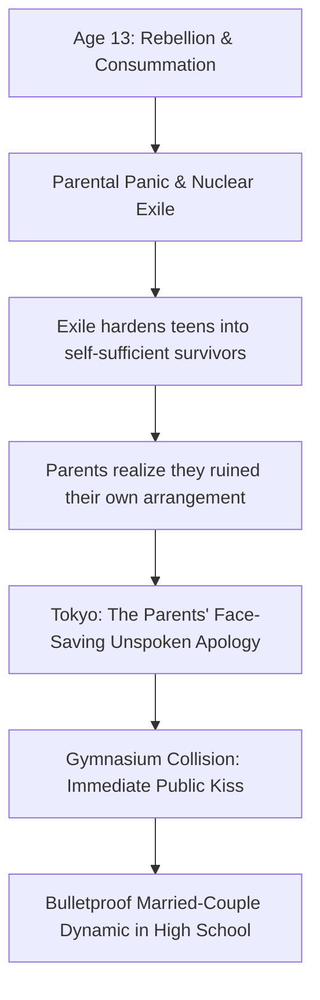

# The Lore Bible — Isabelle & Caspar

## The Families

### van Rijn–Shin Clan

European root: van Rijn Private Banking & Global Real Estate — Dutch banking
dynasty, 17th-century old money based in Wassenaar. The kind of wealth that
doesn't appear on lists because the lists are compiled by people who work for
them.

Korean root: Shin Entertainment — Asia's premier K-pop agency, built post-IMF
crisis by a former dancer who understood that cultural influence appreciates
faster than real estate.

Father: Willem van Rijn — CEO of van Rijn Private Banking. Perpetually in
Zurich, London, or Singapore.

Mother: Shin Hee-yeon — CEO of Shin Entertainment. Compact, sharp bob, minimal
makeup. Enters rooms like a conductor. Loves her daughter fiercely,
strategically, and from behind a desk via structural decisions.

Power base: Finance merged with cultural soft power.

Marriage logic: Old European capital married to new Korean cultural dominance.

### Waldstein–Ryu Clan

European root: Waldstein Botanicals & Aesthetics — ultra-luxury skincare brand,
rooted in Austrian/Bohemian minor nobility that pivoted to luxury branding.

Korean root: Ryu BioPharma & Chemical — industrial chaebol, chemicals-to-pharma
pipeline.

Mother: Helena Waldstein — CEO of Waldstein Botanicals. Silver-blonde hair, navy
blazer, gold chain with the Waldstein logo.

Father: Ryu Ji-seok — Chairman of Ryu BioPharma & Chemical. Communicates in
sentence fragments and strategic silences.

Power base: Beauty and biotech vertical integration.

Marriage logic: European luxury prestige married to Korean industrial
infrastructure.

### The Inter-Family Web

The clans orbit each other through corporate boards and charity galas. Close
enough to plan a generational merger-marriage between their children. Distant
enough that the children never grow up as siblings. The corporate architecture
and personal architecture converge—and eventually detonate.

## The Children

### Isabelle van Rijn / Shin Ji-won

Born: January 14, 2001

Home base: Wassenaar, Netherlands.

Appearance: 5'10", statuesque. Heavy wavy caramel-blonde hair. Pale glowing
glass skin. Flawless posture of a trained dancer.

Languages: Dutch, Korean, English, French, German, Japanese. She downplays her
Japanese fluency; it is just easier to be underestimated.

Physical training: Ballet since age three. The grammar underneath the K-pop
choreography she later learns during the exile.

### Caspar Waldstein / Ryu Tae-sung

Born: March 29, 2001

Home base: Munich, Germany.

Appearance: 6'1", lean but broad-shouldered. Icy pale blue eyes. After the
exile: shoulders broadened by agricultural labor, hands roughened. A farm-built
body that reads as mysterious to teenagers.

Languages: German, Korean, English, Dutch, Japanese. He also downplays his
Japanese.

## The Caretakers

### Moon Jungsook

Assigned to Isabelle since birth. Compact, center-parted bob. Korean in her
cooking and standards, European in her pragmatism. Inspects produce with visible
disapproval. Loyal to Isabelle first, the families second.

### Bae Myunghi

Assigned to Caspar since birth. Tall, broad-shouldered, permed hair. Irons
creases into school trousers because a man without a crease lacks self-respect.
Her cooking is better than Jungsook's, a source of quiet permanent war. Loyal to
Caspar first.

### Their Unified Front

Jungsook and Myunghi know each other and coordinate off the books. In the
updated timeline, they carry a fierce, defensive edge. They know exactly why the
thirteen-year-olds were exiled: they watched the parents tear the kids apart
over a panicked loss of control. Reunited in Tokyo, the caretakers draw a line
in the sand. They will not allow the parents to break these children again. They
do not police sleeping arrangements. Their only rule is that both teenagers eat
breakfast before leaving the apartment.

## Master Timeline

0 / 2001: Born. Caretakers assigned.

10 / 2011: Both enter Institut Le Rosey, Switzerland.

10–13 / 2011–2014: Unengineered friendship develops naturally at Le Rosey.

13 / Spring 2014: The Breakpoint. Discovery of the arrangement, aggressive
rebellion, consummation to claim autonomy, parental panic, nuclear exile.

13–16 / 2014–2017: The Exile. 2.5 years of deprivation. Caretakers removed.
Isabelle trains in Seoul; Caspar farms in Jeju.

16 / April 2017: Reunion in Tokyo. The silent apology. The entrance ceremony
collision.

## The Breakpoint (Spring 2014)

At age thirteen, Isabelle and Caspar learn their meeting was a planned
merger-marriage. Every shared moment is reframed as engineered.

Instead of pulling away, they aggressively reclaim their connection. If their
emotional bond was designed by the parents, they decide to burn the contract by
making their physical relationship undeniably theirs. They consummate the
relationship. It is messy, premature, and driven entirely by the desperate
defiance of thirteen-year-olds trying to establish ultimate autonomy.

When the parents find out, they do not just get angry—they panic. They wanted a
pristine, manageable merger at age twenty-five. They got a volatile,
unsupervised crossing of lines at thirteen. The parents act out of sheer terror
at their loss of control, dropping the hammer to hit the brakes. This triggers
the 2.5-year exile.

## The Exile (2014–Early 2017)

Privilege stripped. Caretakers removed. Zero contact.

Isabelle trains in Seoul with Shin Entertainment's pre-debut group, VESPER. She
learns isolation choreography, dorm hierarchy, and bakes madeleines at 2 AM as
stress relief. She stays to protect the four girls she trains with, voluntarily
abandoning her debut to ensure theirs happens.

Caspar is sent to a Jeju botanical farming cooperative under Waldstein
Botanicals. He builds a rugged, labor-intensive physique. He masters regional
Jeju cooking, which becomes his language of care. He also accidentally discovers
VESPER's pre-debut content and becomes fiercely, privately devoted to the
fandom.

The exile was meant to break their bond. Instead, they survived, hardened, and
learned how to build with their own hands.

## Tokyo: The Silent Apology (April 2017)

When the exile fails to break the teenagers, the parents realize they
accidentally nuked their own master plan. They hardened their kids into
self-sufficient laborers.

Tokyo is not a trap or a punishment. It is a face-saving retreat. Billionaire
chaebol leaders do not say "we made a mistake." They change the geography.
Dropping Isabelle and Caspar in the exact same Setagaya public school and
returning their caretakers is the parents' way of saying: We surrender. Here are
three years to be normal.

### The Entrance Ceremony Collision

Japanese high school entrance ceremonies are rigid, silent, and conformist.
Isabelle and Caspar hear each other's names during roll call. They lock eyes.

There is no slow-burn realization. There is no waiting for an empty hallway.
After 2.5 years of surviving manual labor and trainee abuse to get back to each
other, they don't hesitate. Caspar stands up, walks across the gymnasium floor
in front of three hundred freezing freshmen, and Isabelle meets him. They kiss.
Desperate, possessive, European, completely unapologetic.

The gymnasium short-circuits. In the back row, Jungsook and Myunghi just adjust
their purses.

### The "Bulletproof" Dynamic

There is no "will they/won't they" in this story. They possess the energy of a
fifty-year-old married couple trapped in adolescent bodies. They sit physically
entangled during class breaks. They argue in fluent, hushed German about laundry
detergent. There is zero jealousy; if a classmate hits on one of them, the other
patiently helps let the suitor down.

## The Six Friends

The initial mystery isn't "do they like each other?" It is "what kind of war did
these two survive?" The friends are drawn to the sheer, unapologetic intensity
of their dynamic.

Isabelle's Three: Nakamura Aoi: Dance captain. Detects Isabelle's hidden
physical training. Fujita Moe: Obsessively organized. Notices the structural
coincidences of their lives. Tsukada Rin: Loud, shame-free K-pop fan. Stumbles
onto the VESPER connection eventually.

Caspar's Three: Ogawa Shun: Silent observer. Catalogs Caspar's regional Jeju
skills. Miyake Renta: Golden retriever athlete. fiercely loyal without fully
understanding. Hosokawa Kai: Music kid. Connects the auditory clues of Caspar's
K-pop fandom.

### The Revelation Table

| What the Friends See              | What They Assume            | The Real Reason                                         |
| --------------------------------- | --------------------------- | ------------------------------------------------------- |
| Calloused hands & perfect posture | Weird sports backgrounds    | 2.5 years of Jeju farming & K-Pop training              |
| Aggressive and casual PDA         | Typical loose Westerners    | Desperate trauma-bond from age 13                       |
| Living practically together       | Rebellious runaway dropouts | Billionaire parents' face-saving retreat                |
| Bulletproof mutual protection     | Just intense teenage love   | They sacrificed their lives for each other during exile |

The secret is discovered layer by layer. The hurt experienced by the friends
comes from the asymmetry of vulnerability, not the deception of wealth. The
healing happens at the table—through the Jeju cooking and Seoul baking that
Isabelle and Caspar have always sincerely shared with them.

## Work — Choosing the Dynasty

Isabelle and Caspar do not join school clubs. Out of their own free will, they
take part-time entry-level internships at Shin Entertainment Japan and Ryu
BioPharma Japan. They fetch water and scan inventory under bosses who know
exactly who they are.

This signals absolute victory on their own terms. The parents tried to force the
merger and failed. The teens choose the companies, and each other, autonomously.

## The Stealth Wealth

The wealth never performs. It serves. Name the material, not the brand. Show the
absence of logos. Deploy wealth as quiet problem-solving—a suspiciously nice car
ride, an impossibly sourced ingredient. The friends notice the gap between what
Isabelle and Caspar treat as basic and what is actually basic.

## Tone & Pacing

Tone: Cinematic, grounded, punchy. The comedy is purely cultural friction: two
European trauma-bonded teenagers being aggressively European in a regimented
Japanese school. No cheap drama, no love triangles.

Dialogue: Identifiable speech patterns. Husbands-and-wives banter.

Food as Care: He cooks (Jeju). She bakes (Seoul). It is how they tell the
friends, and each other, that they are safe.
