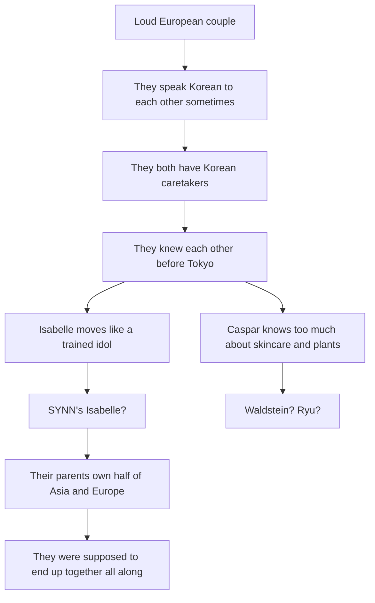

## The Lore Bible — Isabelle & Caspar

---

### The Families

#### van Rijn–Shin Clan

- **European root:** van Rijn Private Banking & Global Real Estate — Dutch
  banking dynasty, 17th-century old money based in Wassenaar
- **Korean root:** Shin Entertainment — Asia's premier K-pop agency, built
  post-IMF crisis in the late 1990s
- **Father:** Willem van Rijn — CEO of van Rijn Private Banking & Global Real
  Estate, perpetually in Zurich, London, or Singapore
- **Mother:** Shin Hee-yeon — CEO of Shin Entertainment, perpetually in Seoul or
  Los Angeles
- **Power base:** Finance merged with cultural soft power — the money moves
  invisibly while the entertainment arm shapes public-facing Asian pop culture
- **Marriage logic:** Old European capital married to new Korean cultural
  dominance — a merger disguised as a love story

#### Waldstein–Ryu Clan

- **European root:** Waldstein Botanicals & Aesthetics — the number one
  ultra-luxury skincare brand in Asia, rooted in Austrian/Bohemian minor
  nobility that pivoted to luxury branding
- **Korean root:** Ryu BioPharma & Chemical — industrial chaebol,
  chemicals-to-pharma pipeline
- **Mother:** Helena Waldstein — CEO of Waldstein Botanicals & Aesthetics,
  perpetually in Paris, Tokyo, or Shanghai
- **Father:** Ryu Ji-seok — Chairman of Ryu BioPharma & Chemical, perpetually in
  Seoul or Frankfurt
- **Power base:** Beauty and biotech vertical integration — Waldstein is the
  consumer-facing brand, Ryu is the industrial engine behind it
- **Marriage logic:** European luxury prestige married to Korean industrial
  infrastructure — another merger disguised as a love story

#### The Inter-Family Web

The van Rijn–Shin and Waldstein–Ryu clans orbit each other through overlapping
corporate boards, charity galas, and real estate circles spanning Alpine resorts
and Jeju coastlines. Close enough to plan a generational merger-marriage between
their children. Distant enough that the children never grow up as siblings. Both
families are no strangers to arranged consolidation — this is simply the latest
in a centuries-long tradition dressed up in modern clothes.

---

### The Children

#### Isabelle van Rijn / Shin Ji-won

- **Full name:** Isabelle van Rijn / Shin Ji-won (신지원)
- **Born:** ~2001
- **Home base:** Wassenaar, Netherlands — old-money enclave near The Hague
- **Education pre-Rosey:** Dutch private elementary school in Wassenaar
- **Languages:** Dutch, Korean, English, Japanese — all fluent
- **Cultural literacy:** Deep knowledge of Korean and Japanese culture, customs,
  and business etiquette — acquired through years of private tutoring
- **Physical training:** Trained ballerina from a very young age — discipline,
  body awareness, pain tolerance, and performance instinct are second nature
- **Appearance:** European-presenting first, Korean second — reads as Dutch
- **Emotional anchor:** Moon Jungsook, her Korean caretaker since birth
- **Parent dynamic:** Both parents working constantly — Willem in financial
  capitals, Hee-yeon in entertainment capitals. Isabelle is raised by staff and
  structure, not by warmth from above

#### Caspar Waldstein / Ryu Tae-sung

- **Full name:** Caspar Waldstein / Ryu Tae-sung (류태성)
- **Born:** ~2001
- **Home base:** Munich, Germany — likely Bogenhausen or Grünwald
- **Education pre-Rosey:** German private elementary school, Gymnasium-track
- **Languages:** German, Korean, English, Japanese — all fluent
- **Cultural literacy:** Deep knowledge of Korean and Japanese culture, customs,
  and business etiquette — acquired through years of private tutoring
- **Appearance:** European-presenting first, Korean second — reads as German
- **Emotional anchor:** Bae Myunghi, his Korean caretaker since birth
- **Parent dynamic:** Both parents working constantly — Helena in luxury
  capitals, Ji-seok in pharma and chemical hubs. Caspar is raised by staff and
  structure, not by warmth from above

---

### The Caretakers

#### Moon Jungsook (문정숙)

- **Assigned to:** Isabelle, since birth
- **Path:** Wassenaar → Le Rosey → separated during exile → reunited in Tokyo
- **Role:** Functionally Isabelle's mother — the one who taught her Korean,
  poured the first bowl of miyeokguk on her birthdays, code-switched between
  warmth and discipline
- **Loyalty:** Reports to the families but leaves things out — loyal to Isabelle
  first

#### Bae Myunghi (배명희)

- **Assigned to:** Caspar, since birth
- **Path:** Munich → Le Rosey → separated during exile → reunited in Tokyo
- **Role:** Functionally Caspar's mother — the one who carried the Korean
  identity line his parents were too busy to transmit
- **Loyalty:** Reports to the families but leaves things out — loyal to Caspar
  first

#### Their Relationship

Jungsook and Myunghi know each other. Both are ajumma-generation women — warm
but firm, formal Korean manners. They were powerless against the families during
the exile but never stopped caring. In Tokyo they meet for tea, compare notes,
and carefully curate what gets reported back. They cook too much and send the
kids home with containers for the other household. They are the only continuity
these children have ever had.

---

### Master Timeline

- **0 / ~2001:** Born. Jungsook assigned to Isabelle in Wassenaar. Myunghi
  assigned to Caspar in Munich.
- **0–10 / 2001–2011:** Childhood. Dutch private schools for Isabelle, German
  private schools for Caspar. Korean cultural and language tutoring runs
  parallel to European education. Ballet training begins early for Isabelle.
  Neither child knows the other exists.
- **10 / 2011:** Both enter Institut Le Rosey, Switzerland. Isabelle pulled from
  Wassenaar, Caspar straight after Grundschule.
- **10–13 / 2011–2014:** Friendship develops naturally at Le Rosey. Same dorm
  circles, both half-Korean, both raised by Korean caretakers. The parents
  simply put them in proximity and let them figure out the rest.
- **13 / Spring 2014:** The breakpoint. Discovery of the arrangement, the
  poisoning of trust, the kiss, the rejection, the rebellion.
- **13–16 / Mid 2014–Early 2017:** The exile. 2.5 years. Privilege stripped.
  Caretakers separated from them. Isabelle in Seoul as a K-pop trainee. Caspar
  on Jeju as a farm laborer.
- **16 / April 2017:** Reunion. First day of Japanese high school. Entrance
  ceremony at Tokyo Metropolitan Setagaya Sogo High School. Neither knows the
  other will be there.

---

### Le Rosey Period (2011–2014)

#### How They Met

No grand introduction. Two ten-year-olds in the same elite Swiss boarding
school, both half-Korean, both with Korean caretakers hovering at the margins of
campus life. The parents engineered the proximity — same school, same year,
overlapping social circles — and then stepped back. Isabelle and Caspar did the
rest naturally.

#### How the Friendship Built

Three years of shared meals, study sessions, weekend outings, ski trips, and the
quiet understanding that comes from being the same kind of hybrid in a sea of
European old money. They recognized each other — not just ethnically but
experientially. Both raised by caretakers instead of parents. Both fluent in
languages their classmates didn't speak. Both navigating the gap between their
European faces and their Korean interiors.

By twelve they were inseparable. By thirteen they were something more.

---

### The Breakpoint (Spring 2014)

#### The Sequence

**Stage 1 — Discovery of the arrangement.** At thirteen, Isabelle and Caspar
learn that their meeting at Le Rosey was not coincidence. Their families have
planned a merger-marriage. Every shared moment, every natural step of their
friendship, is reframed as engineered. The trust between them is poisoned
instantly.

**Stage 2 — The poisoning.** Neither can look at the other without wondering
what was real. The friendship curdles. Both are angry — at the families, at each
other, at themselves for not seeing it.

**Stage 3 — The kiss.** Isabelle tries to kiss Caspar. It is not romantic
impulse — it is an act of defiance and salvage. She is trying to prove to him,
and to herself, that what they have exists independent of the arrangement. "This
is not engineered."

**Stage 4 — The rejection.** Caspar rejects her. Not because he doesn't feel it
— because he can no longer separate what he feels from what was designed for him
to feel. The rejection is self-protective, not cruel. But it devastates
Isabelle.

**Stage 5 — The rebellion.** Both turn against their families. The specifics of
the rebellion are less important than its message: we refuse to be your merger.
The families respond with exile.

---

### The Exile (Mid 2014–Early 2017)

2.5 years. Privilege stripped. Caretakers removed. The one constant in their
lives — gone. No contact between Isabelle and Caspar. The families' logic: show
them how good they had it. Break the rebellion through deprivation.

#### Isabelle's Exile — K-pop Trainee, Seoul

Shin Hee-yeon places her own daughter into the trainee program at Shin
Entertainment. Not as the CEO's daughter — as a body in the practice room.
Isabelle's ballet background gives her discipline, body awareness, pain
tolerance, and performance instinct. K-pop training adds vocal work, variety
skills, group hierarchy, and dorm life with strangers who don't care about her
last name.

Hee-yeon designed this as punishment. She is building a 4-member girl group —
SYNN — and Isabelle is never meant to debut with them. The training is the
exile, nothing more.

What Hee-yeon did not expect: Isabelle earns her place. As far as skill is
concerned, nothing is handed to her. She trains alongside the four members who
will debut, matches their discipline, learns their choreography, becomes part of
the formation. Hee-yeon watches this happen and lets it run its course — knowing
the entire time how it ends.

Isabelle does not know she will not debut with SYNN until a few months before
debut. The other four members know who she is — the CEO's daughter — but they
watched her genuinely earn it. That earns a specific kind of loyalty.

Hee-yeon's mother is in the same building. They have no contact.

#### The Threat That Sends Isabelle to Tokyo

Hee-yeon threatens the debut. If Isabelle does not leave for Tokyo and enter
high school, the debut that all five girls worked toward for 2.5 years does not
happen. Isabelle leaves voluntarily to protect the four girls she trained
alongside. She sacrifices the life she earned to save theirs. SYNN debuts as a
4-member group. Isabelle starts high school in Japan.

#### Caspar's Exile — Botanical Harvest Labor, Jeju

Ryu Ji-seok or Helena Waldstein places Caspar at the bottom of Waldstein
Botanicals' supply chain — the Jeju farming cooperative that harvests the
high-end botanical ingredients the brand charges a fortune for. Centella, green
tea, camellia, wild herbs. Caspar works the fields. Rural isolation,
backbreaking agricultural hierarchy, seniority-based labor culture. His mother
is the CEO of the brand. She never visits.

What the exile gives him that money never could:

- Farm-built body, functional strength → He doesn't look like a gym kid or a
  Japanese high school boy — broader, rougher, tanned
- Weathered hands, calm physicality → Quiet confidence that stands out in a room
  of sixteen-year-olds
- Deep knowledge of plants, soil, seasons → Accidentally became an expert in
  what his mother charges hundreds per bottle for
- Patience, stillness, rhythm of the land → Reads as mysterious to teenagers
  used to noise
- Jeju food → The island's cuisine found him — he cooks at the level of the
  caretakers but everything he makes is deeply, specifically Jeju

He makes jeonbokjuk (abalone porridge) with the patience of the dish itself.
Galchi jorim (braised hairtail) learned from an ajumma who didn't know his last
name. Heuk dwaeji gui (black pork) — he knows the cuts. Hallabong anything. Wild
herb banchan from plants he harvested himself. After 2.5 years the Jeju
cooperative is family.

#### The Threat That Sends Caspar to Tokyo

Waldstein Botanicals threatens to drop the sourcing contract with the Jeju
cooperative. If Caspar does not leave for Tokyo and enter high school, the
people who took him in lose their livelihood — the one contract that keeps their
operation viable. Caspar leaves to protect them. Same sacrifice as Isabelle,
different world.

#### What the Exile Does to Both of Them

Both discover through the separation that they love each other. The exile was
supposed to break them. Instead it clarified what was real. 2.5 years without
contact, without their caretakers, without privilege — and the only thing they
carry is the memory of the other person.

---

### SYNN (씬)

#### Overview

Shin Entertainment's flagship project. The group Shin Hee-yeon is personally
building as her legacy act — not just another roster addition. Hard-hitting,
performance-focused. Think aespa-level fame and cultural impact.

#### Members

- **Main dancer, center:** Jung Hayeon (정하연) — Fills Isabelle's spot in
  formation. Closest to Isabelle during training — the one who cried when she
  left.
- **Main vocalist:** Park Soyeon (박소연) — Vocal powerhouse. Oldest of the
  group, protective unnie energy.
- **Lead vocalist, visual:** Seo Yerin (서예린) — The public face. Graceful, the
  camera loves her.
- **Main rapper, lead dancer:** Baek Dain (백다인) — The edge. Youngest,
  fearless, probably the one who talks back to management.

#### Isabelle's Role During Training

One of the dancers — not main dancer, because Hee-yeon knew from the start what
would happen. But Isabelle earned her position legitimately. Choreography was
originally built for five. When she leaves, the formations are restructured
around four, but the ghost of the fifth position lingers.

#### Post-Debut

SYNN debuts as a 4-member group at approximately the same time Isabelle starts
high school in Tokyo. They blow up — aespa-level fame. The public story for
Isabelle is likely "a trainee who didn't make the cut." The four members have to
swallow that lie.

#### What the Members Carry

- Choreography rebuilt from five to four — a formation with a ghost in it
- Loyalty to Isabelle, quiet resentment toward the CEO
- A public narrative that erases what Isabelle earned

#### LINE Group Chat — 새벽5시 (5 AM)

The five of them maintain a LINE group chat: **새벽5시** (saebyeok daseos-si —
"5 AM"). Double meaning: the time they started every training day together, and
there are five of them. Simple, private, no outsider would think twice. But
every notification Isabelle receives in Tokyo carries the weight of that
practice room.

Isabelle follows SYNN's career from Tokyo. She watches their debut, their music
show wins, their rise. The life she earned happening without her.

---

### Tokyo — The New Strategy

#### The Logic

Exile didn't break them. The parents reverse approach — ordinary life, public
school, no family name carrying weight. The thinking: without privilege, without
spectacle, just two teenagers in a normal Tokyo life, they'll bore each other
into growing apart. Neither Isabelle nor Caspar is told the other will be in
Tokyo. As far as each knows, this is punishment continuing — alone, ordinary, a
fresh start nobody asked for.

#### The School

**Tokyo Metropolitan Setagaya Sogo High School (都立世田谷総合高等学校)** — a
public high school in Setagaya ward. No international school buffer. Maximum
cultural friction. Japanese students, Japanese customs, Japanese social codes.

#### Living Arrangements

- **Isabelle + Jungsook:**
  - **Neighborhood:** Sakurashinmachi (桜新町)
  - **Vibe:** Quiet residential, tree-lined, family-oriented
  - **Home:** 2LDK apartment, upper-middle-class
  - **Train line:** Den-en-toshi Line
- **Caspar + Myunghi:**
  - **Neighborhood:** Yoga (用賀)
  - **Vibe:** Slightly more connected, still calm and leafy
  - **Home:** 2LDK apartment, similar scale
  - **Train line:** Den-en-toshi Line
- **Distance apart:** Two stops, walkable if they want

Close enough to find each other after school. Far enough that the families can
claim they aren't making it easy. The apartments and all expenses are paid for
by the families. The budget is modest by dynasty standards but comfortable —
upper-middle-class Japanese living.

#### The Caretakers Return

Jungsook and Myunghi rejoin them in Tokyo after 2.5 years of separation. The
reunion isn't just Isabelle and Caspar finding each other — it's the return of
the only parental warmth either of them has ever known. Korean food in Setagaya
kitchens. A familiar voice after years of silence.

---

### The Entrance Ceremony (入学式) — April 2017

Neither knows why they were sent to Japan. Neither knows the other is there.

Gymnasium, folding chairs, new uniforms that still feel stiff. Names read by
class assignment. Somewhere in the rows of black-haired strangers in identical
uniforms, one of them hears the other's name — or just sees them.

Two half-Korean kids who haven't spoken in 2.5 years. The last memory between
them is a rejected kiss and family warfare. Now in matching uniforms in a Tokyo
public school gym.

**Same class.**

Behind them in the guardian seating, Jungsook and Myunghi are already sitting
together. They knew.

---

### The Reunion Arc

- **Day 1:** They see each other at the entrance ceremony. Shock. No public
  scene — just eye contact that carries 2.5 years of weight.
- **After school, Day 1:** They exchange LINE contacts.
- **Weeks 1–2:** They talk over LINE about everything. Every night, long
  conversations. The exile, the training, Jeju, SYNN, the kiss, the rejection,
  what they felt, what they understand now. Total emotional excavation.
- **End of Week 2:** They reconcile.
- **First weekend after reconciliation:** They spend the weekend together.
- **From that point on:** They are a couple. Fully, physically, openly,
  unapologetically.

---

### The Relationship — How It Looks

#### The Linguistic Playbook

- **Intimate, private:** Korean — 자기야 (jagiya), whispered, apartment nights
- **Serious conversations:** English — neutral ground, neither family's language
- **Public performance:** Bad Japanese — the act, the cover — deliberately Dutch
  or German-accented
- **Flirting in plain sight:** German or Dutch — "Küsschen?" / "Kusje?" — nobody
  around them understands
- **Arguing:** Mixed — Korean starts it, English escalates, Dutch or German
  lands the final blow
- **With caretakers:** Korean — always, non-negotiable

Caspar says "Küsschen?" in the middle of a crowded hallway. Isabelle answers in
Dutch. Classmates hear what sounds like two different European languages and
assume they can't understand each other properly. Meanwhile they just negotiated
a kiss, a dinner plan, and an insult about someone's shoes.

#### The Performance — What They Hide

- **What they show:** Dutch/German-accented Japanese, halting → **What they
  hide:** Near-native fluency, keigo and all
- **What they show:** Fumbling with chopsticks → **What they hide:** Years of
  Korean and Japanese dining etiquette
- **What they show:** Confused by school customs → **What they hide:** Deep
  cultural literacy via tutoring
- **What they show:** "Just European kids" → **What they hide:** Chaebol/dynasty
  heirs worth billions
- **What they show:** Couple who met at school → **What they hide:** Years of
  history, exile, heartbreak

They don't let on how good their Japanese is. They don't reveal they speak
English and Korean. They look European — Dutch and German — first, Korean
second. They deliberately perform foreignness. The friends who patiently teach
chopstick grip and explain shoe locker etiquette to two kids who already know —
those are the real ones.

#### The Physical Dynamic

This is not a Japanese high school romance. This is two European-raised
teenagers who spent 2.5 years apart from their best friend and lover, and they
show it.

- **Week 3:** Together, physical immediately — hands, arms, laps in public.
  Isabelle sits on Caspar's lap in the classroom. They kiss in front of
  classmates. → Half the class short-circuits. Nobody does this. Even dating
  couples in Japanese high school barely make eye contact in the hallway.
- **Month 1:** They sleep together — natural, no drama, no big declaration. For
  them it's a continuation, not a milestone. → For European teenagers this is
  normal. For their Japanese context it's seismic.
- **Ongoing:** Caspar stays at Sakurashinmachi, Isabelle stays at Yoga.
  Weeknight sleepovers become routine. → Jungsook and Myunghi allow it. They
  report "the kids see each other regularly."

They are not disrespecting Japanese culture — they understand it perfectly. They
are refusing to hide after 2.5 years of being punished for what they feel. Every
kiss is defiance. The Japanese social code just makes the contrast louder.

Within a week they are the most talked-about pair in the school. Some students
are horrified. Some are secretly thrilled by the energy.

#### The Evidence Trail — What the Friends Notice

- His t-shirt folded in her bag — Moe notices, helping Isabelle find something,
  sees a men's shirt
- She smells like his cologne — Rin notices, sitting close as always — "you
  smell different... wait that's what Caspar smells like"
- They arrive from the same direction on a Tuesday morning — Shun notices, takes
  the same train line, sees them exit together at 7am from the Yoga direction
- His hair is still wet some mornings — Renta notices, "Did you just shower?
  Your place is 40 minutes away how are you—"
- She has two apartment keys on her keychain — Aoi notices, files it away
  silently
- He packs two bentos some mornings — Kai notices, "Who's the second one for —
  oh."

None of this is scandalous to Isabelle and Caspar. When Rin says "you smell like
him" Isabelle just says **"I know"** and smiles. No embarrassment. No denial.
Completely European about it. The friends are slowly losing their minds piecing
together a mystery the couple isn't even trying to hide — they just don't
consider it remarkable.

#### Caspar's Bento

Caspar brings food to school that looks nothing like anyone else's. Not
convenience store onigiri, not standard mom-made Japanese bento. Strange,
fragrant, deeply Korean in a way even Korean kids wouldn't recognize immediately
— because it's specifically Jeju. Jeonbokjuk in a thermos. Black pork over rice.
Wild herb banchan. The guys who sit down and say "let me try that" with genuine
curiosity — those are his three.

Food is also the private language between Isabelle and Caspar. He cooks for her.
She loves it. It's one of the quiet intimacies that the apartment sleepovers are
built around.

#### Isabelle's Tell

Her body betrays her. Ballet spine, idol-trained stage awareness — she stands
differently from every girl in the room. Unconscious rhythm when music plays.
Her uniform fits the same as everyone else's but looks different somehow. In PE
class, first week, she dials it back hard but even at 60% she moves like nobody
else in that gym. She catches herself, plays clumsy, laughs it off in bad
Japanese. But three girls saw it.

---

### The Six Friends

#### How They're Found

Isabelle and Caspar "adopt" each of their three friends within the first two
weeks — but the friends approach them first. This is the filter. The friends who
step up to help the "helpless foreigners" with zero knowledge of who they
actually are — those are the real ones.

#### Isabelle's Three

- **Nakamura Aoi (中村葵):** Captain of the dance club. Direct, competitive,
  zero filter. Says exactly what she thinks. → Sees Isabelle move in PE and
  won't let it go. Walks up after class and says "you've trained."
- **Fujita Moe (藤田萌):** Soft-spoken, obsessive planner, carries snacks for
  everyone. The group mom before there's a group. → Finds Isabelle looking
  "lost" in the hallway and draws her a hand-written map of the school.
- **Tsukada Rin (塚田凛):** Loud, funny, zero shame. Class clown energy but
  emotionally sharp underneath. → Sits next to Isabelle on day one and starts
  talking like they've known each other for years.

#### Caspar's Three

- **Ogawa Shun (小川駿):** Quiet, reads constantly, notices everything, says
  little. The observer. → Sits near Caspar, smells the food, watches quietly
  until Caspar offers.
- **Miyake Renta (三宅蓮太):** Baseball club, loud, physical, golden retriever
  energy. No hidden agenda ever. → Sees Caspar's build and immediately asks if
  he plays anything.
- **Hosokawa Kai (細川海):** Music kid, plays guitar, slightly rebellious
  streak. The cool one. → Catches Caspar humming something Korean and gets
  curious.

#### The Merge

The two friend groups merge into a single circle of eight over time. The friends
eventually pick up linguistic fragments. Renta tries to learn "Küsschen" without
knowing what it means. Rin starts demanding translations. Aoi watches and takes
notes.

---

### The Unraveling — Secrets Discovered Layer by Layer

Everything besides them being a couple is a maze of secrets that get uncovered
while they just behave like an over-the-top European couple in a Japanese high
school. The narrative tension is that the friends are solving a mystery the
couple barely cares about protecting — Isabelle and Caspar are too busy being in
love to manage the cover story.

#### The Layers

#### Who Cracks What

- **Ogawa Shun** — Caspar's Korean food isn't amateur — it's deeply regional and
  skilled (Week 2) → The observer — watches quietly, says nothing yet
- **Nakamura Aoi** — Isabelle's "clumsy" PE performance has trained muscle
  memory underneath (Week 3) → Competitive dancer — knows what disciplined
  movement looks like
- **Tsukada Rin** — They switch to Korean when they think nobody's listening
  (Month 1) → Always sitting too close — catches everything
- **Fujita Moe** — The caretakers — two Korean women picking them up separately.
  She sees Jungsook and Myunghi having coffee together. (Month 2) → The planner
  — notices patterns and logistics
- **Miyake Renta** — Caspar's "part-time job" is in Nihonbashi — what part-time
  job for a sixteen-year-old is in the pharma district? (Month 3) → No filter —
  just blurts "that doesn't make sense"
- **Hosokawa Kai** — Hears SYNN playing from Isabelle's earbuds, sees a LINE
  notification with a selfie from Hayeon in a practice room (Month 4) → Music
  kid — recognizes industry context

No single bombshell. Six puzzle pieces held by six people who eventually start
comparing notes. **"Wait — you noticed that too?"**

#### The Betrayal Arc

The secrets sting not because the friends were used but because the
vulnerability felt one-directional. The friends offered genuine help —
hand-drawn maps, chopstick lessons, patient explanations of school customs — to
people who didn't need it.

"I taught you chopsticks. You already knew."

The friendship is real. That's what survives. But the wound needs to heal first.

---

### Work — Choosing the Dynasty

After the parents learn about the relationship, the budget expands. Not lavish —
but the ceiling lifts. Better groceries, new clothes, travel allowance. More
importantly, both Isabelle and Caspar make a decision on their own: they want to
be part of the family businesses.

They start working in Shin and Ryu subsidiaries in Tokyo instead of joining club
activities. This is voluntary. The rebellion is over — not because they
surrendered, but because the exile built them into people who actually want to
contribute.

- **Isabelle** — Shin Entertainment Japan, Shibuya office (handles J-pop market,
  SYNN's Japanese releases). After-school intern, trainee management and A&R.
- **Caspar** — Ryu BioPharma Japan, Nihonbashi office (pharmaceutical
  distribution, R&D liaison). After-school intern, logistics and supply chain.

#### The School Cover

No club activities is socially visible in Japanese high school — teachers ask,
students notice. "Part-time job" is the cover story. Normal enough for two
foreign kids. Nobody questions it.

#### The Signal to the Families

Two teenagers independently requesting positions at family subsidiaries tells
the parents everything. The exile didn't break them — it built them. The
relationship is real. They're ready. The parents tried force and it failed. The
kids choosing the dynasty on their own terms — that's the real merger.
