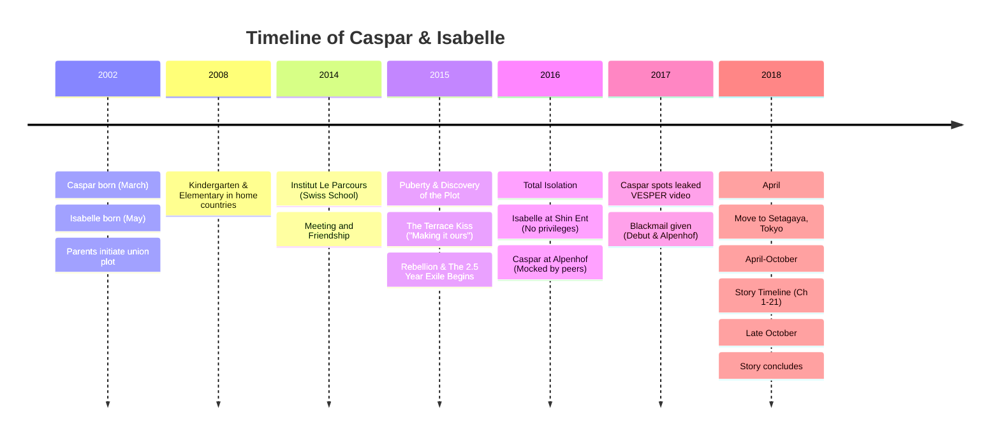

# SHINRYU

## 1. THE WORLD

**Setting:** Tokyo. Timeplate: Early April to late October 2018. The story is
anchored in Setagaya Ward. The primary location is Tokyo Metropolitan Setagaya
Sogo High School (nicknamed Seta-sō), their modest Setagaya apartments, local
neighborhood streets, and the Futako-Tamagawa commercial area. Additional
settings include flashbacks to Seoul and Munich.

**Tone:** Literary YA. Slow-burn romance with precision prose. Sensory density
(food, photography, skincare, darkroom chemistry). Emotional restraint
punctuated by moments of overwhelming honesty. Korean used for private/intimate
dialogue (always with inline translation). The writing alternates between
Isabelle's and Caspar's POV, sometimes within the same chapter.

**Structural pattern:** Each chapter has 4–6 sections separated by`---`.
Sections alternate between the two protagonists and their respective social
orbits. Major beats land in section endings. Time markers at section openings
(day, time, location).

**Geographic Identity:** Setagaya. Unassuming, standard middle-class Japanese
apartments. No floor-to-ceiling windows or doormen; just small balconies and
narrow kitchens where the Aunties work miracles. Their daily walk takes them
along the Tamagawa river toward Futako-Tamagawa Station, replacing the glamorous
commutes of their pasts.

## 2. SETA-SŌ (THE SCHOOL)

**Tokyo Metropolitan Setagaya Sogo High School (都立世田谷総合高等学校)**
Located in Okamoto 2-chome, Setagaya-ku. A 15-minute walk from Futako-Tamagawa
Station (Tokyu Den-en-toshi/Oimachi lines). Futako-Tamagawa serves as their
primary after-school hangout hub (cafes, the riverbank, Takashimaya).

- **The Building:** Distinctive yellow building, though the school's image color
  is green (reflected in the upcoming Suifūsai / Green Wind Festival).
- **School Culture:** "No Chime, No Broadcast." There are no bells and no PA
  announcements. Students must self-manage their time, creating natural tensions
  and requiring absolute hyper-vigilance from students like Yuki, while giving
  Caspar and Isabelle quiet moments undisturbed by artificial alarms.
- **The Curriculum Tracks:** Seta-sō uses six "series" (Society & Culture,
  Environment & Science, International & Cultural Understanding, Information
  Design, Life Design, Manufacturing/Engineering). This structural separation
  allows the main friend group to easily occupy different orbits throughout the
  day before converging at lunch.
- **Demographics:** Solidly average (hensachi around 50) and unpretentious.
  Girls naturally outnumber boys in the student body.

## 3. THE PARENTS' PLOT

The families (Shin, Ryu, Waldstein, van Rijn) already cooperate on a massive
global scale, but a marriage merger was planned from the children's birth
(Caspar born March 2002, Isabelle born May 2002).

- **The Discovery (2015):** The teens discovered the master plan during middle
  school at Institut Le Parcours. The manipulation disgusted them.
- **The Rebellion (Late 2015):** The terrace kiss was Isabelle's attempt to
  "make this ours" despite the plan. Both actively rebelled against their
  families.
- **The 2.5 Year Exile (2015–2018):** As punishment and psychological breakage,
  both were stripped of all privileges and isolated for 2.5 years, heavily
  monitored with strict no-contact rules.
- **The Tokyo Agreement (2018 Leverage):** They only agreed to attend Seta-sō
  due to targeted corporate blackmail by their parents.
  - **Isabelle's Leverage:** Shin Hee-yeon threatened to cancel/withhold
    VESPER's debut entirely if Isabelle did not comply. She sacrificed her
    freedom for her members' dreams.
  - **Caspar's Leverage:** Ryu Ji-seok and Helena threatened to liquidate or
    restructure Hotel Alpenhof and fire its staff (Gerhard, Maggie, Frau
    Lindner) who had become Caspar's only real family during his exile.

## 4. ISABELLE / SHIN JI-WON (16)

### Isabelle - Backstory

Born May 2002. Grew up in Wassenaar, Netherlands (Kindergarten/Elementary).
Attended Institut Le Parcours (Swiss boarding school), met Caspar, formed a deep
bond.

**The Terrace Incident:** Attempted to kiss Caspar. It wasn't just romance; it
was a desperate bid for autonomy ("to make this ours"). Her rebellion led to her
exile.

**The Exile (2.5 Years):** Forced into the grueling Shin Entertainment trainee
system. Stripped of all wealth and privileges. Handled exactly like a trainee
with zero nepotism. Shin Hee-yeon was in the same building daily but enforced a
strict no-contact protocol.

### Isabelle - Skills & Habits

- **Baking:** Professionally trained. Can produce Michelin-level pastries. In
  her cramped Setagaya kitchen, she makes it work despite the standard Japanese
  fish-grill oven.
- **Dance:** 5 years ballet + 2.5 years grueling K-pop training under Park
  Jisoo.
- **Language filter:** Pretends her Japanese is weaker than it is to control
  perception. Also fluent in Dutch, Korean, English, French, German.

### Isabelle - Living Situation

Setagaya Ward. A standard 2LDK apartment. Modest, "nothing flashy," blending in
perfectly with regular Tokyo life. Auntie Choi navigates the tiny kitchen with
militant precision.

## 5. CASPAR / RYU TAE-SUNG (16)

### Caspar - Backstory

Born March 2002. Grew up in Bogenhausen, Munich (Kindergarten/Elementary).
Attended Institut Le Parcours with Isabelle. Turned away from the kiss because
he recognized the trap of the parents' design, but spent years regretting it.

**The Exile (2.5 Years):** Sent to Hotel Alpenhof. Stripped of his identity,
subjected to brutal 12-hour shifts. He was mocked and humiliated by former
Swiss-school classmates whose families vacationed there.

**Finding Her:** He discovered Isabelle was at Shin Ent through a leaked,
low-resolution 240p training video. He had exactly 15 minutes of internet access
per day on a shared staff computer, which he spent scraping forums and obscure
blogs for any sign of her or VESPER.

### Caspar - Skills & Habits

- **Photography:** Leica M6, 35mm film. Developing involves careful chemical
  timing in a small converted closet. His focal length calculations are
  reflexive; the depth of field formula $ \text{DoF} \approx \frac{2 N c f^2
  u^2}{f^4} $ runs in his head when composing tight shots.
- **Coffee:** Trained by Maggie at Alpenhof. Uses a V60 pour-over.
- **VESPER Fandom:** He was there from the underground pre-debut era, scraping
  low-res leaks.

### Caspar - Living Situation

Setagaya Ward. A modest footprint matching Isabelle's, perhaps specifically
chosen by the parents to force "humility." Auntie Park cooks transcendent
jjajangmyeon in a kitchen so small she has to hand-pull noodles in the living
room.

## 6. VESPER

**Debut Status:** Debuted entirely because Isabelle submitted to the Tokyo
arrangement.

**Members:** Minji, Yuna, Haeun, Jiwoo.

**The Leaked Video:** A blurry, unauthorized clip of Jiwoo and a "shadow
trainee" (Isabelle) doing early choreography. This pixelated file is what
sustained Caspar through the Alps.

## 7. THE FRIENDS ("THE TABLE")

They eat lunch together daily at Seta-sō. Because the school uses a specific
curriculum track system, the friends are organically separated during many
blocks but always converge at the same desk formulation. The 2018 setting means
technology is slightly different (no widespread TikTok; LINE and early Instagram
dominate).

### Isabelle's Friends (Class 1-3)

**Takahashi Yuki:** Forensic observer. Uses the school's "no chime" policy to
perfectly clock class times. Knew about Isabelle's background early but said
nothing because "it wasn't her truth to take."

**Yamamoto Sora:** VESPER superfan. Cried when she discovered Isabelle's
identity. Kenji's primary love interest.

**Ogawa Hina:** Quiet watcher. Spent the summer reading and writing essays on
observation along the Tamagawa river.

### Caspar's Friends (Class 1-2)

**Watanabe Kenji:** Social glue. Defended the group's unity during the big
reveal in the Seta-sō shoe-locker area with his "shoe-locker speech."

**Ito Ren:** Track runner. Caspar anonymously bought him 38,000 JPY carbon
spikes via the exhibition.

**Kuroda Daiki:** Data analyst (Information Design track). Plays/builds
procedural games. Disassembled a VESPER lightstick.

## 8. KEY ARTIFACTS & FOOD CANON

- **Leaked 240p Video**: The only proof Caspar had that Isabelle existed for 2.5
  years.
- **Madeleines**: Isabelle's love language, adapted perfectly to her small
  Setagaya oven.
- **38,000 JPY Spikes**: Anonymously bought for Ren through the photo
  exhibition.
- **여기서부터**: Translated as "From here." Written in Caspar's notebook.
- **The Leica M6**: Caspar's anchor. "Bring your camera" equals bring yourself.
- **Setagaya Balcony**: The narrow slice of Tokyo where they can finally speak
  honestly.

**Established Food Canon:** Galbi-jjim, Bulgogi, Kimchi-jjigae, Dakgalbi, and
Isabelle's specific Pâte sucrée remain essential to the sensory landscape,
prepared in tight quarters by the Aunties.
